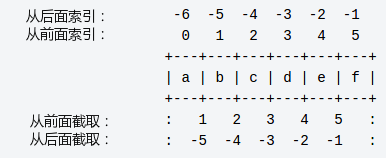

# Python3 基本数据类型

1. Python 中的变量不需要声明

2. 变量在使用前都必须赋值

3. 变量就是变量，它没有类型

4. 同时为多个变量赋值

   ```python
   a = b = c = 1
   a, b, c = 1, 2, "runoob"
   ```

5. 六个标准的数据类型：

   * Number（数字） 不可变
   * String（字符串） 不可变
   * List（列表） 可变
   * Tuple（元组） 不可变
   * Set（集合） 可变
   * Dictionary（字典） 可变

6. Number

   支持 **int、float、bool、complex（复数）**。

   isinstance 和 type 的区别在于：

   - type()不会认为子类是一种父类类型。
   - isinstance()会认为子类是一种父类类型。

7. del使用方法

   ```python
   del var1[,var2[,var3[....,varN]]]
   del var
   del var_a, var_b
   ```

8.  数值运算

   * 2 / 4  # 除法，得到一个浮点数
   * 2 // 4 # 除法，得到一个整数
   * 2 ** 5 # 乘方

9. String

   

10. List 列表

    * 使用最频繁
    * 列表中元素的类型可以不相同
    * 在方括号 **[]** 之间、用逗号分隔开的元素列表
    * 列表同样可以被索引和截取，列表被截取后返回一个包含所需元素的新列表。
    * 

11. Tuple 

    * 元组的元素不能修改。元组写在小括号 **()** 里
    * 元组（tuple）与列表类似
    * 元组与字符串类似
    * 虽然tuple的元素不可改变，但它可以包含可变的对象，比如list列表

12. Set

    * 集合（set）是由一个或数个形态各异的大小整体组成的，构成集合的事物或对象称作元素或是成员。

    * 功能是进行成员关系测试和删除重复元素。

    * 可以使用大括号 **{ }** 或者 **set()** 函数创建集合，注意：创建一个空集合必须用 **set()** 而不是 **{ }**，因为 **{ }** 是用来创建一个空字典。

    * 创建格式：

      ```python
      parame = {value01,value02,...}
      或者
      set(value)
      ```

13. dictionary

    * 字典（dictionary）是Python中另一个非常有用的内置数据类型。
    * 列表是有序的对象集合，字典是无序的对象集合。两者之间的区别在于：字典当中的元素是通过键来存取的，而不是通过偏移存取。
    * 字典是一种映射类型，字典用 **{ }** 标识，它是一个无序的 **键(key) : 值(value)** 的集合。
    * 键(key)必须使用不可变类型
    * 在同一个字典中，键(key)必须是唯一的